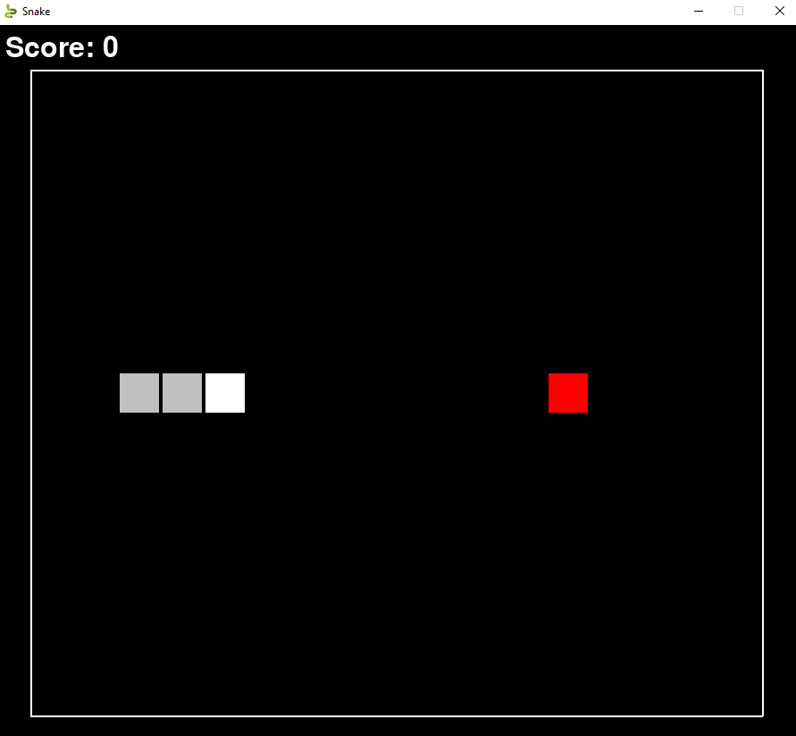
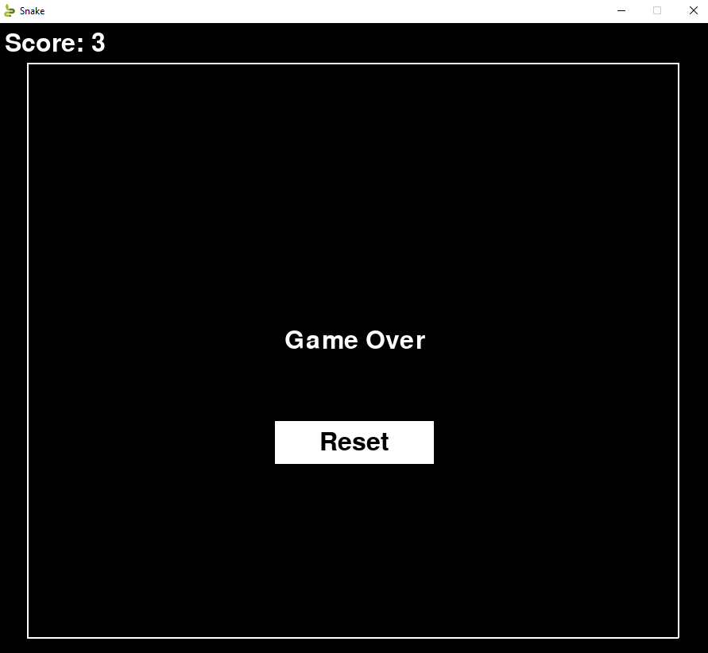

# Snake

## Introduction
This is just a basic game made in pygames. This is just to practice a little python and get some experience in making a game

## Screenshots



## Required Libraries
* pygame
```
pip3 install pygame
```

## Usage
To start the script, opne terminal in the folder and type
```
python3 main.py
```
This should launch a pygame window </br>
Use the arrow keys to control the snake